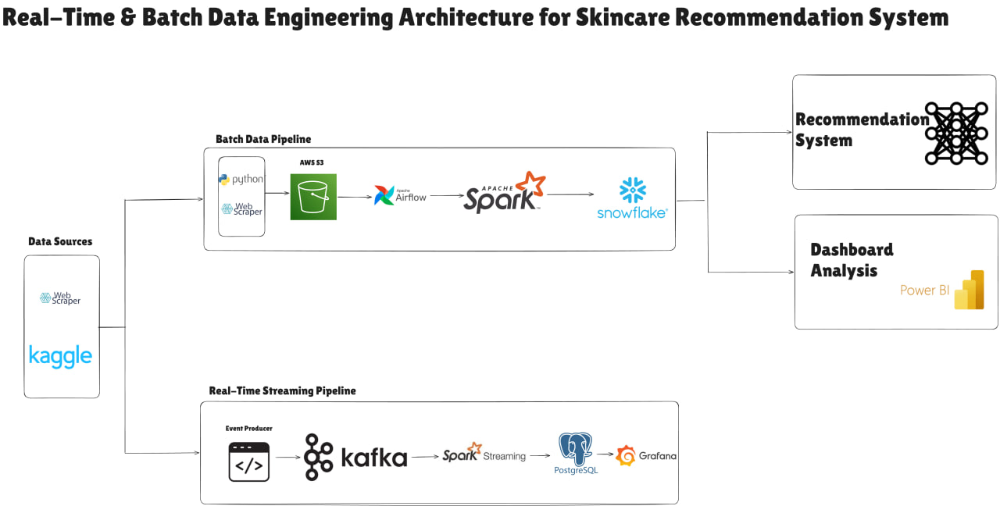
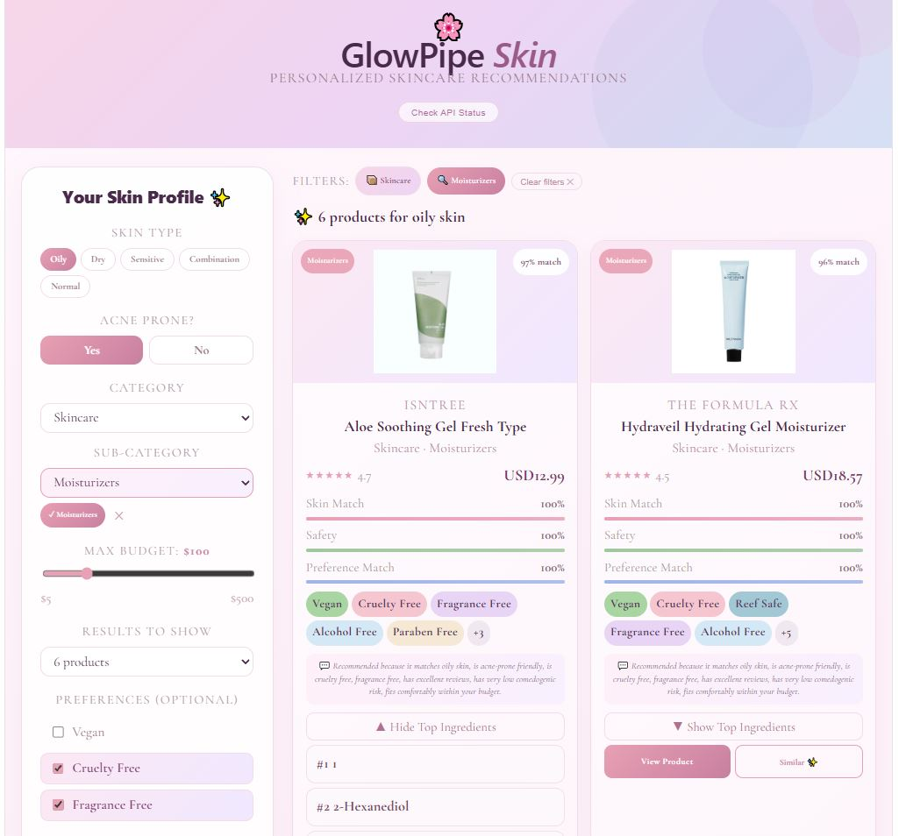
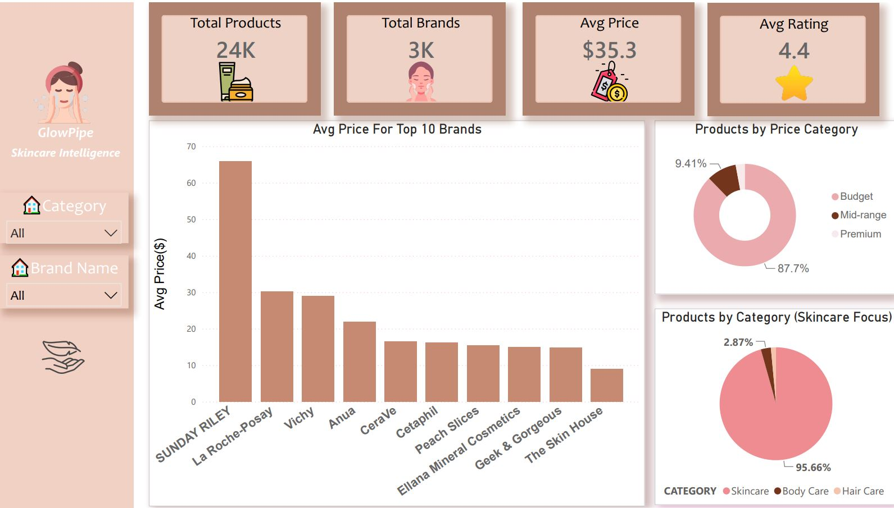

# GlowPipe — Real-Time & Batch Data Engineering Platform for Skincare Recommendations

<p align="center">
  
</p>

<p align="center">
  <strong>A production-grade data engineering platform combining batch pipelines, real-time streaming, a recommendation system, and cloud data warehousing — built for the skincare industry.</strong>
</p>

<p align="center">
  
  
  
  
  
  
  
  
  
  
</p>

---

## Table of Contents

- [Overview](#overview)
- [Architecture](#architecture)
- [Medallion Architecture](#medallion-architecture)
- [Data Sources & Scale](#data-sources--scale)
- [Tech Stack](#tech-stack)
- [Batch Pipeline](#batch-pipeline)
- [Streaming Pipeline](#streaming-pipeline)
- [Snowflake Data Warehouse](#snowflake-data-warehouse)
- [Recommendation System](#recommendation-system)
- [API Endpoints](#api-endpoints)
- [Dashboards](#dashboards)
- [Engineering Challenges](#engineering-challenges)
- [Setup Guide](#setup-guide)
- [Team](#team)

---

## Overview

GlowPipe is a production-style data engineering platform that brings personalized skincare intelligence to consumers and businesses. It processes data at scale across both batch and real-time dimensions — from raw web-scraped product catalogs to live user event streams — ultimately powering a hybrid recommendation engine and a suite of BI dashboards.

| Audience | Value |
|---|---|
| Consumers | Personalized product recommendations matched to their skin profile |
| E-commerce platforms | Real-time conversion funnel analytics and product trending signals |
| Business owners | Live behavioral analytics and ingredient safety monitoring |
| Data teams | A reference architecture for medallion lakehouse + streaming design |

---

## Architecture

<p align="center">
  
</p>

GlowPipe operates two parallel pipelines that converge at the analytics and serving layer:

### Batch Pipeline
```
Web Scrapers (Python + Selenium)
        ↓
AWS S3  ── Bronze Layer (raw data)
        ↓
Apache Airflow (orchestration)
        ↓
Apache Spark ETL ── Silver Layer (cleaned) → Gold Layer (analytics-ready)
        ↓
Snowflake Data Warehouse
        ↓
Recommendation API  ·  Power BI Dashboards
```

### Streaming Pipeline
```
Event Producer (user interactions)
        ↓
Apache Kafka (event bus)
        ↓
Spark Structured Streaming
        ↓
PostgreSQL (streaming storage)
        ↓
Grafana Real-Time Dashboards
```

---

## Medallion Architecture

GlowPipe follows a **Bronze → Silver → Gold** medallion lakehouse design.

### 🥉 Bronze Layer — Raw Ingestion
Stores unmodified data as ingested from all sources, landed on **AWS S3**. Sources include Dermstore, Skincarisma, Kaggle datasets, and Amazon enrichment pipelines.

### 🥈 Silver Layer — Cleaning & Standardization
Transforms raw data into a consistent, trusted dataset. Key operations:
- Schema normalization and type casting
- Product deduplication
- Null handling and value imputation
- Price and size enrichment (via Amazon pipeline)
- Ingredient normalization and canonical mapping
- Category and country standardization
- Safety feature engineering
- Data quality validation

### 🥇 Gold Layer — Analytics-Ready Warehouse
A Snowflake star schema optimized for BI queries and recommendation serving. Contains fact tables, dimension tables, and pre-computed recommendation views.

---

## Data Sources & Scale

| Source | Purpose |
|---|---|
| Dermstore | Product catalog and metadata |
| Skincarisma | Skin scores and product attributes |
| Paula's Choice | Ingredient safety dictionary |
| Kaggle | Supplementary skincare datasets |
| Amazon (enrichment) | Price and size enrichment |

| Metric | Volume |
|---|---|
| Total Products | 24,000+ |
| Total Brands | 3,000+ |
| Unique Ingredients | 32,000+ |
| Product–Ingredient Relations | 100,000+ |
| Active Ingredients | 15,000+ |

---

## Tech Stack

| Layer | Technologies |
|---|---|
| Data Ingestion | Python, Selenium, BeautifulSoup |
| Data Lake | AWS S3 |
| Orchestration | Apache Airflow |
| Batch Processing | Apache Spark (PySpark) |
| Streaming | Apache Kafka + Spark Structured Streaming |
| Data Warehouse | Snowflake |
| Streaming Storage | PostgreSQL |
| Monitoring | Grafana |
| API Layer | FastAPI |
| Recommendation Engine | Python, Scikit-learn |
| Business Intelligence | Power BI |
| Infrastructure | Docker Compose |

---

## Batch Pipeline

Airflow orchestrates a daily scheduled DAG that moves data through all three medallion layers before loading into Snowflake.

```
Bronze Ingestion → Silver Cleaning → Gold Feature Build → Snowflake Load
```

Key design choices:
- Modular, independently-retriable Spark jobs per layer
- Retry strategy with alerting on failure
- Broadcast joins for large-scale ingredient lookups
- Partitioned writes for efficient downstream queries

---

## Streaming Pipeline

The streaming layer answers what batch cannot: **what is happening right now.**

### Kafka Topics

| Topic | Description |
|---|---|
| `user_events` | User interaction events (views, add-to-cart, purchases) |
| `product_safety` | Safety reaction reports |
| `ingredient_alerts` | Ingredient concern signals |

### Real-Time Use Cases

| Signal | Business Value |
|---|---|
| Viral Product Detection | Identify trending products before they sell out |
| Allergen Outbreak Detection | Alert when multiple users report unsafe reactions within minutes |
| Live Conversion Funnel | Monitor views → cart → purchase → abandonment in real time |
| Price Pressure Analytics | Flag products causing abandonment due to pricing |
| Ingredient Spike Detection | Track sudden spikes in ingredient concern signals |

---

## Snowflake Data Warehouse

GlowPipe uses a **star schema** design optimized for analytical queries and BI tool connectivity.

### Fact Tables

| Table | Description |
|---|---|
| `FACT_PRODUCT_FEATURES` | Recommendation-ready feature vectors per product |
| `FACT_PRODUCT_INGREDIENT` | Product–ingredient bridge with metadata |

### Dimension Tables

| Table | Description |
|---|---|
| `DIM_PRODUCT` | Core product attributes |
| `DIM_BRAND` | Brand metadata |
| `DIM_CATEGORY` | Category and sub-category hierarchy |
| `DIM_INGREDIENT` | Ingredient attributes and safety ratings |
| `DIM_SOURCE` | Data provenance |
| `DIM_DATE` | Date dimension for time-series analysis |

---

## Recommendation System

<p align="center">
  
</p>

The recommendation engine is a **hybrid content-based + rule-based system** that combines skin-profile matching with ingredient intelligence and safety scoring.

### User Inputs

Users filter by skin type, acne-prone sensitivity, category, sub-category, and budget — plus any combination of:

`Vegan` · `Cruelty-Free` · `Fragrance-Free` · `Alcohol-Free` · `Paraben-Free` · `Silicone-Free` · `Oil-Free` · `Reef Safe` · `Pregnancy Safe` · `Fungal Acne Safe`

### Recommendation Scoring

```
Final Score =
  35%  Skin Match
  20%  Product Rating
  15%  Review Confidence
  15%  Safety Score
  10%  Preference Match
   5%  Affordability
```

### Safety Score

```
Safety Score =
  50%  Low Comedogenic Risk
  25%  Pregnancy Safe
  25%  Fungal Acne Safe
```

### Similar Product Engine

Powered by **cosine similarity** over Scikit-learn feature vectors, enabling feature-based discovery of products that are compositionally alike.

---

## API Endpoints

The recommendation engine is served through a **FastAPI** backend.

| Endpoint | Method | Description |
|---|---|---|
| `/health` | GET | API health check |
| `/recommend` | POST | Generate personalized recommendations |
| `/similar-products` | GET | Cosine-similarity-based product discovery |
| `/products/{id}` | GET | Full product details |
| `/ingredients/search` | GET | Ingredient lookup and safety info |

---

## Dashboards

Power BI dashboards provide business intelligence across four themes. All dashboards support filtering by **Category** and **Brand Name**.

<p align="center">
  
</p>

### Product Analytics
Key metrics: **24K products · 3K brands · $35.3 avg price · 4.4 avg rating**

- Average price by top 10 brands (Sunday Riley leads at ~$67; CeraVe and Cetaphil among the most affordable)
- Product distribution by price tier: 87.7% Budget · 9.4% Mid-range · 2.9% Premium
- Category breakdown: 95.7% Skincare · 2.9% Body Care · remaining Hair Care

### Ingredient Intelligence
Key metrics: **32K total ingredients · 2K caution ingredients · 15K active ingredients**

- Research level distribution: 67.5% Well-Researched · 29.9% Under Research · 1.6% Supportive
- Top 10 most common ingredients: Glycerin, Water, Phenoxyethanol, Butylene Glycol, Ethylhexylglycerin, and more
- Formula complexity by category: Lip Makeup has the most complex formulas (~35 avg ingredients/product)

### Skin Safety
Key metrics: **3K pregnancy-safe · 3K oily skin · 3K sensitive skin · 2K fungal-acne-safe products**

- Pore Risk Distribution: 95.7% Low Risk · 3.9% Moderate Risk
- Pore Safety Score by Category: Face Makeup and Skincare score safer than Body Care
- Pregnancy-safe product count: Skincare category dominates by a large margin

### Clean Beauty
Key metrics: **2K cruelty-free · 2K paraben-free · 2K fragrance-free · 1K silicone-free**

- Clean Beauty Distribution: 56.3% Partially Clean · 39% Mostly Clean · 4.7% Fully Clean
- Vegan vs Non-Vegan: 93.3% Non-Vegan · 6.7% Vegan
- Top clean beauty brands: Dermorepubliq, The Originote, Skintific, The Ordinary, Luxe Organix

---

## Engineering Challenges

| Challenge | Solution |
|---|---|
| Missing product prices | Amazon enrichment pipeline with fallback logic |
| Inconsistent schemas across sources | Silver-layer normalization with canonical mapping |
| Product duplication across scrapers | Spark deduplication on composite keys |
| Ingredient name inconsistency | Canonical ingredient dictionary |
| Real-time aggregation complexity | Spark Structured Streaming with stateful operators |
| Streaming state management | Watermarks and checkpoint-based recovery |
| Large-scale ingredient joins | Broadcast joins for small-dimension tables |
| Recommendation explainability | Human-readable reason generation per recommendation |

---

## Setup Guide

### 1. Clone the Repository

```bash
git clone https://github.com/NouranMohamed07/GlowPipe.git
cd GlowPipe
```

### 2. Configure Environment Variables

```bash
cp .env.example .env
```

```env
AWS_ACCESS_KEY_ID=your_key
AWS_SECRET_ACCESS_KEY=your_secret

SNOWFLAKE_USER=your_user
SNOWFLAKE_PASSWORD=your_password
SNOWFLAKE_ACCOUNT=your_account
```

### 3. Install Dependencies

```bash
pip install -r requirements.txt
```

### 4. Start All Services

```bash
docker-compose up -d
```

### 5. Start Airflow

```bash
airflow standalone
```

### 6. Run the Batch Pipeline

```bash
spark-submit batch/spark_jobs/bronze_to_silver.py
```

### 7. Start the Kafka Producer

```bash
python streaming/kafka/producer.py
```

### 8. Run the Streaming Job

```bash
spark-submit streaming/spark_streaming/stream_job.py
```

### 9. Start the API

```bash
uvicorn app.main:app --reload
```

---

## Repository Structure

```
GlowPipe/
│
├── batch/
│   ├── airflow/dags/         # Airflow DAG definitions
│   ├── spark_jobs/           # PySpark ETL scripts (bronze → silver → gold)
│   ├── scraping/             # Web scrapers (Selenium, BeautifulSoup)
│   └── dw/                   # Snowflake DDL and loaders
│
├── streaming/
│   ├── kafka/                # Producer and topic configuration
│   ├── spark_streaming/      # Structured streaming jobs
│   ├── postgres/             # Schema and migrations
│   └── grafana/              # Dashboard configurations
│
├── skincare_recommender_api/
│   ├── app/                  # FastAPI application entry point
│   ├── recommender/          # Scoring and ranking logic
│   ├── ingredients/          # Ingredient intelligence module
│   └── schemas/              # Pydantic models
│
├── Dashboard/                # Power BI report files (.pbix)
├── deployment/               # Docker and infrastructure configs
├── docs/
│   └── images/               # Screenshots used in this README
│       ├── architecture.png
│       ├── recommendation_ui.png
│       └── powerbi_dashboard.png
│
├── requirements.txt
├── docker-compose.yml
└── README.md
```

---

## Future Roadmap

- [ ] Kubernetes deployment for horizontal scaling
- [ ] Full AWS cloud deployment (EKS, MSK, RDS)
- [ ] CI/CD pipeline with GitHub Actions
- [ ] dbt for warehouse transformation layer
- [ ] ML-based ranking model replacing rule-based scoring
- [ ] Redis caching for recommendation API
- [ ] Vector similarity search for ingredient embeddings
- [ ] LLM-powered skincare advisor chatbot
- [ ] Feature Store integration
- [ ] User authentication and profile persistence

---

## Team

| Name |
|---|
| Nouran Mohamed |
| Marwa Elhussieny |
| Hanin Hossam |
| Sherine Tarek |
| Noha NouReldin |

---
